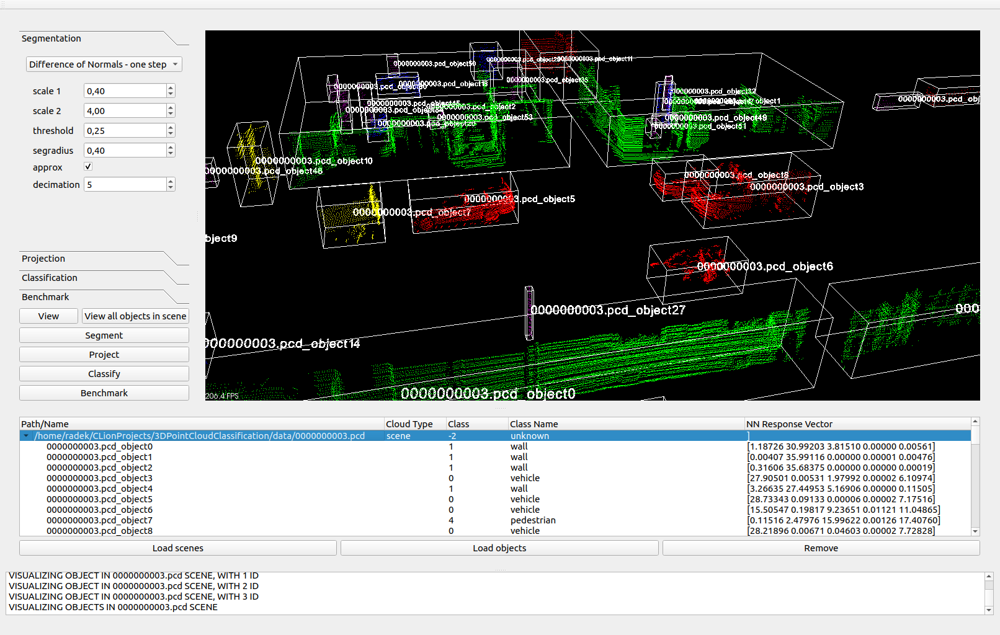
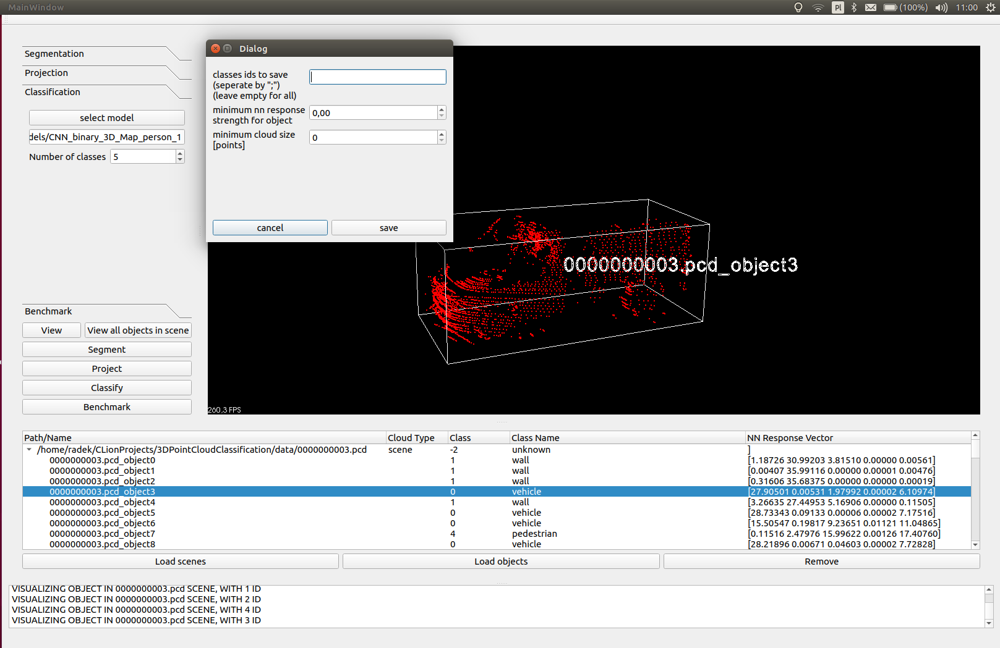
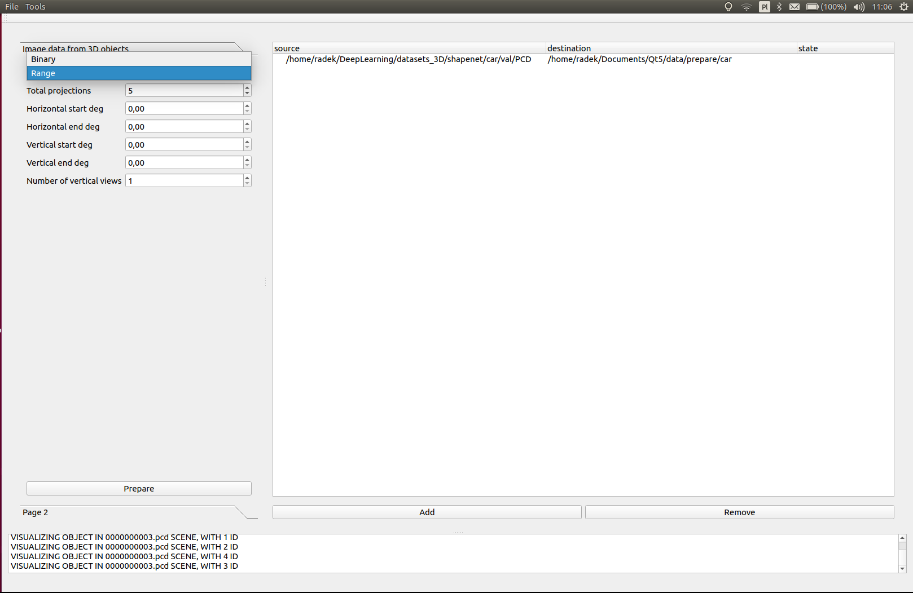
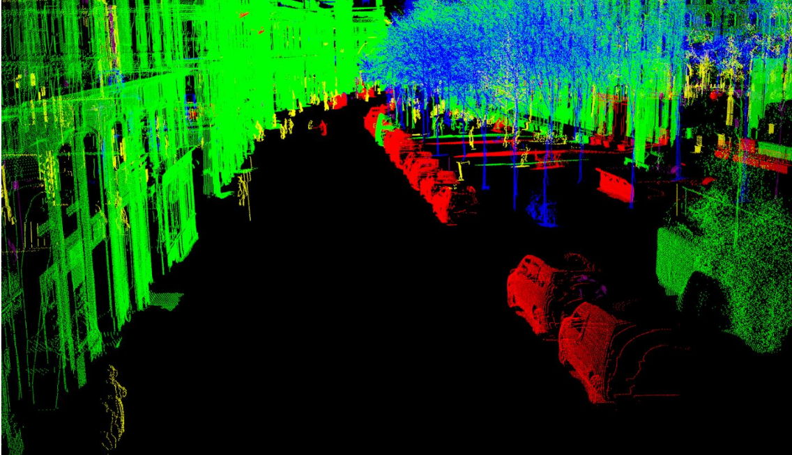
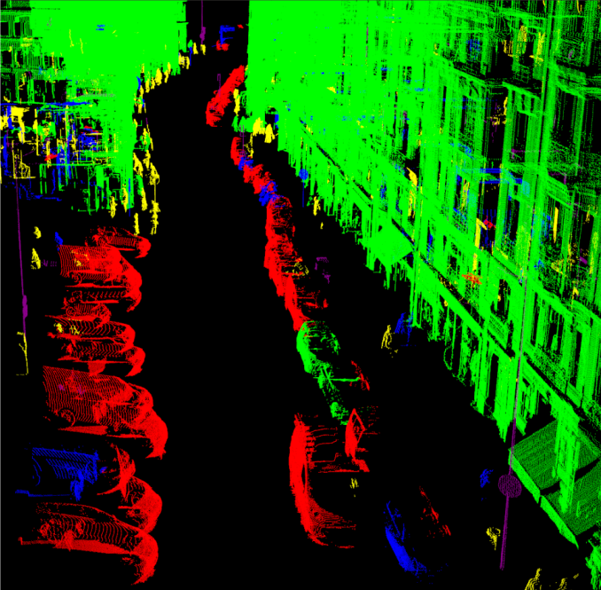

## 3D Point Cloud Classification Tool

It's a tool used for classifying 3D point clouds and testing diffrent classification models, segmentation, projection parameters and so on. By means of this tool you can also get 2D projections (binray or range) from 3D objects, so yuo can prepare trainign data for your models. Models can be trained using my other repository : "CNN_binary".
I tested it with point clouds from KITTI Vision Benchmark Suite[1] and IQmulus & TerraMobilita[2] (better classification results, but longer calculations).  

### Supported functions:
	* view point clouds - visualize with colors classified objects 
	* segment point cloud scenes
	* get projections (binary or range) of 3d point cloud objects
	* classify scenes (objects in them) or single objects (get class id and neural net response vector)
	* get benchmark file for classified point clouds (annotations as in Apollo 3D format)
	* save/load parameter configurations
	* save/load clouds that fulfill special requirements (class, min. neural net response, size)
	* preprare training data - get 2D projections (binray or range) from 3D objects (range or binary) 

Code is written in a way that allows easy extension of functionality.

### Usage:
	* load point cloud scenes or objects (.pcd or .bin)
	* select clouds you want to perform operations on
	* select parameters (segmentation, projection, classification model, benchmark type, class mapping and so on)
	* perform required operation (view, segment, project,..., save buttons)

### Dependency:
	Tested with PCL 1.9,tensorflow-gpu 1.12.0, Qt 5.12 and VTK-8.2.0, python >=3.5 under ubuntu 18.04 and 16.04
	Temporary use tensorflow 1.9 with "CNN_range_SemanticKITTI" and tensorflow >=1.10 for other models. 
When using AppImage from releases, only these dependencies are required:
###     
	python >= 3.5, tensorflow, numpy
	
to build:
```
mkdir build && cd build && cmake .. && make
```
	







[1] Technology, Karlsruhe Institute of, „The KITTI Vision Benchmark Suite,” [Online].
Available: http://www.cvlibs.net/datasets/kitti/raw_data.php?type=city. [Acces date: 25 January 2018]

[2] B. Vallet, M. Brédif, A. Serna, B. Marcotegui i N. Paparoditis, „TerraMobilita/iQmulus
urban point cloud analysis benchmark,” Computers and Graphics, 49, pp. 126-133, 2015.

